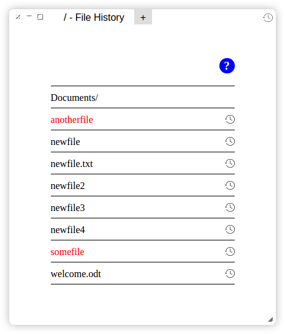

# File History App FAQ

{: .img-container .file-hist #sidebar}

## Why are those little history icons missing for all files?

Airborn OS only records file history when you're on a paid plan. If you recently changed to a paid plan, Airborn OS will start recording file history as soon as you start modifying files.

## Why are those little history icons missing for some files?

A file doesn't show history if:

  - The file has never been edited since you switched to a paid plan.
  - It is a directory (ending in "/").

## Where are my files?

The File History App shows only your files which are on the storage called "sdcard". Whether or not the files you are looking for are stored on there depends on the app you used to create them. Media like music, photos and videos are likely somewhere else, as well as data stored internally inside the app. It also depends on the app in what directory your files are stored and whether they have recognizable names.

## How do I navigate to find my files?

Names ending in "/" are directories. Click on them to enter that directory. Click on "⇡ One level up" to go out of the directory again. "⇡ One level up" is not visible in the outermost directory.

## How do I restore a previous version of a file?

Click on the little history icon next to the name of the file. You will find a list of versions, chronologically sorted. Click on "Restore" next to a version to restore the file to that version.

## Why are some files red?

Red files have been deleted. Click "Restore" next to the latest version to restore them.